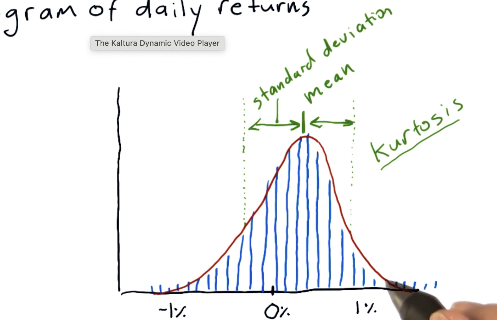

1. Daily retuns = open price - close price
    - Or how we do it in the course => ***(Today's Price / Yesterday's price) - 1***
2. If you plot daily returns on a histogram, you would get a bell curve.
    - This is true for most things that occur in nature.
3. Once you plot a histogram you can calcualte several key statics such as: mean, std, median, ***kurtosis***

### Kurtosis

- It tells you about the tails of a distribution

- Measure of Kurtosis tells you how much different our histogram is from a traditional Normal/Gaussian distribution
    - if measure of kurtosis = ***+ve*** => Fat Tails
        -  More values present at the tails compared to a standard normal distribution.
    - if measure of kurtosis  ***-ve*** => Skinny Tails
        - Less values present at the tails compared to a std noraml dist.