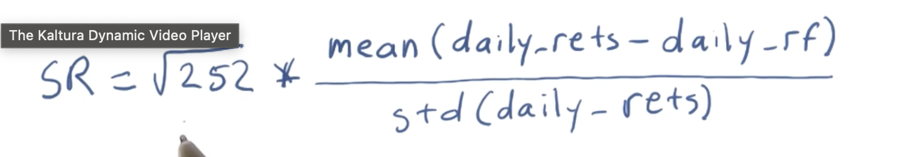

1. What is portfolio optimization?
    - Given a set of assets and a time period, allocate funds to maximize the performace.
2. What is performance?
    - Includes many metrics such as cumulative returns, volatility or risk, and ***Sharpe ratio*** (risk adjusted return).
3. A portfolio is an allocation of funds to a set of stocks. 
4. To calcualte the total value of a portfolio day by day 
    - We have a dataframe that contains all the stocks and their prices day by day with date as the index.
    - First, normalize the prices ==> stock_prices / stock_prices[0]
    - Second, multiply the normalized values by the allocations to the each of the equities.
        - Ex: We have $1 million. We allocated [40% to spy, 40% to XOM, 10% to GooG, 10% to GLD]
        - The first row of the df is all 1s because of the normalizing.
        - multiply [0.4, 0.4, 0.1, 0.1] with each stocks in the dataframe.
    - Third, multiply our alloc df (from step==>2) * start_values.
        - Remeber start_value = $1 million
    - Fourth, to calcualte the total value of the assets, we sum the values along rows.
        - This gives us the total value per each day.
        - On day 1, this is obviously $1 million
        - sum(axis = 1)
<hr>

## Important Statistics that can b done on the portfolio

1. Cumulative Return: How much the value went up from beginning to the end.
```py
(stock_values[-1]/stock_values[0]) - 1
```
2. Average daily return: Mean of the total daily retuns
```py
stock_values.mean()
```
3. Std of daily retuns or ***risk***: std of the total daily reunts
```py
stock_values.std()
```
4. Sharpe Ratio: ????

<hr>

## Sharpe Ratio

1. Sharpe Ratio: Consider our return or rewards in the context of risks.
    - Its a measure that adjusts a return for that risk. It enables us to access them in a quantiative way.
    - Risk is viewed in terms of ***STD*** as it represents volatility.
    - Sharpe Ratio is also known as ***Risk Adjusted Return***
2. It also considers *risk free rate of return*
    - I.e when you put your money in a risk free asset like bank account.
    - This metric help you identify whether your investment in stock gives you better performance than a bank
3. Calculating Sharpe Ratio:
    - R<sub>p</sub>: Portfolio return
    - R<sub>f</sub>: Risk free rate of return.
    - S<sub>p</sub>: standard deviation of portfolio return.
    ```py
    Sharpe_ratio = mean(daily_returns - daily_risk_free_returns) / std(daily_returns - daily_risk_free_returns)
    ```
4. Where to get risk free rate from?
    - Interest rate on the 3 month treasury bill
    - LIBOR
    - 0 % is a also a good approximation for the risk free rate. But if this is different from treasury bill interest rate, use that instead. 
    - Another shortcut to calcualte risk free rate is 
        - (1.0 + 0.1)<sup>1/252</sup> - 1
        - 1 is your investment. Could be $1 million
        - 0.1 ==> 10% interest or how much ever interest is offered.
        - 1/252 ==> There are 252 trading days in a calendar year.
5. Finally, the typical equation to calcualte sharpe ratio is just a little different from above:
    ```py
    Sharpe_ratio = mean(daily_returns - daily_risk_free_returns) / std(daily_returns)
    ```
    - Daily risk free return is dropped from STD because it is a constant and shouldn't cause too much difference.
6. Sharpe Ratio is intended to be used as an annaul measure. If it is used for anything besides annual statisitics, an ***adjustment factor*** should be added to make it work
    - Understand the rate at which you are sampling
        - Annual sampling rate ==> 252
        - Weekly sampling rate ==> 52
        - Monthly sampling reate ==> 12
    ```math
    Adjusted_SR = K * SR
    ```
    - K = (sampling frequency)<sup>1/2</sup>
        - daily sampling, K = 252<sup>1/2</sup>
7. Finally, ***sharpe ratio*** formula:
    - SR = (252)<sup>1/2</sup> * mean(daily_returns - daily_risk_free_returns) / std(daily_returns - daily_risk_free_returns)
    
8. Larger the value of sharpe ratio the better!