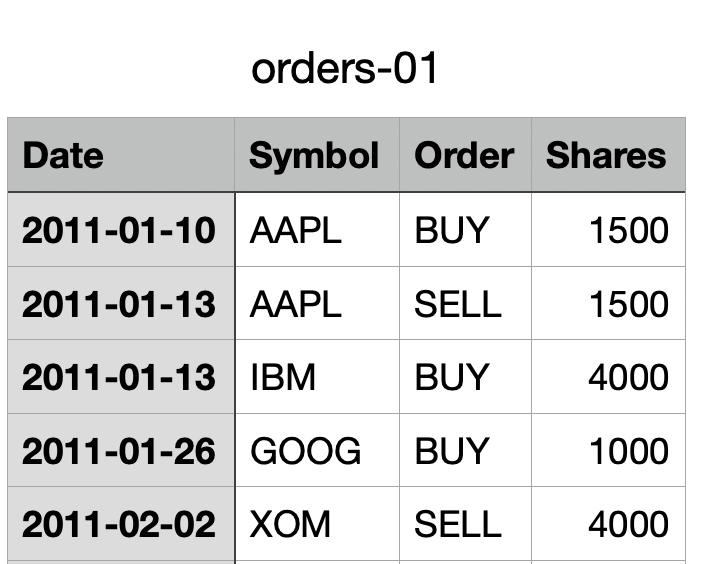

## Market Simulator
Our function should return a dataframe that is indexed by `date` and one data column that includes the value of the portfolio.
- function looks like this
```py
def compute_portvals(  		  	   		 	   		  		  		    	 		 		   		 		  
    orders_file="./orders/orders.csv",  		  	   		 	   		  		  		    	 		 		   		 		  
    start_val=1000000,  		  	   		 	   		  		  		    	 		 		   		 		  
    commission=9.95,  		  	   		 	   		  		  		    	 		 		   		 		  
    impact=0.005,  		  	   		 	   		  		  		    	 		 		   		 		  
): 
```
- Basically what is the value of portfolio between 1st day and last day inclusive.
- Each row of the orders_files is of the format:
    - Date, Symbol, Order(`buy or sell`), #of shares 
    - Date format: ***yyyy-mm-dd***<br>
    
    - In the last row there is a `sell` order for ***XOM***. There was no buy order before this order for XOM.
        - How can you sell before you buy?
            - This is **Shorting**
- Use only `adjusted close` for this project

#### Recommended approach to solving this project
1. Import the orders file as a dataframe.
2. Look at the start-date, end-date, and symbol values.
3. Use the get_data function to pull `adj close` data of these stocks between those dates.
    - get_data will create a dataframe for you that contains every single trading day between start date and end date for all the symbols in that order file.
    - basically columns contains stock names and their `adj close` prices for those days.
4. To the dataframe created in step 3, add additional column called **cash** 
5. Now, copy this dataframe into another and call it **Trades**
    - This dataframe keeps track of changes to the shares bought or sold for each stock (symbol).
        - If you bought 50 shares of AAPL, then AAPL column would be +50. If you sold 25 stocks on the next day, for that row it should show -25 for AAPL. 
        - Same approach for all the other stocks 
        - If no change, mark it as 0.
    - To achieve this, make all rows besides the date column as you need it for tracking. Then populate it step by step as the you notice changes in shares. 
    - How to populate it?
        - Come back to the orders file and step through it row by row. 