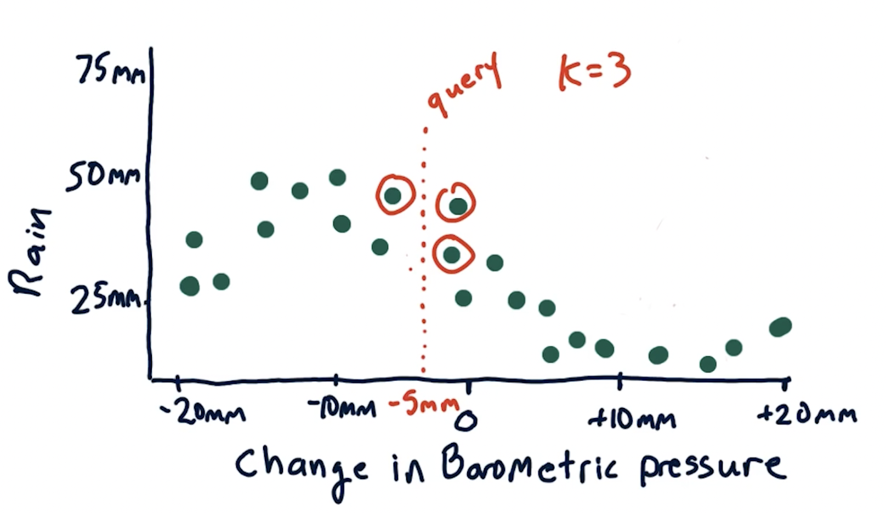
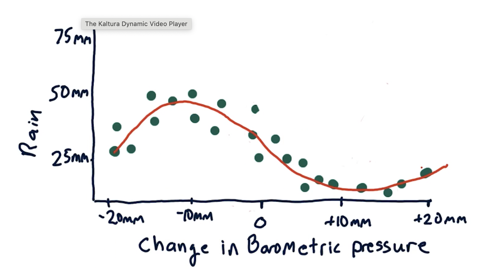

## K-nearest-neighbor
### Also known as Instance model
- KNN doesn't use any parameters. Just the mean values of the surrounding data points.
- KNN is a type of Supervised learning.

1. In KNN, we keep the historic data instead of throwing it away - as we do in linear regression.
2. We refer to the historic data when we are trying to make a prediction.
3. For example, you have barometer readings on the x-axis and quantity of rain on y-axis.

    - As barometre value falls, the higher it rains.
4. We want to make a predicition of rain when Barometer reading is ***-0.5mm***
    - If K = 3, we take 3 closest values of x to -0.5mm.
    - For those 3 x values chosen (as seen in the picture), we get the y-values.
    - Take the mean of those y-values. That is the prediction.
5. It is useful when fitting a curve as we are dealing with mean values:<br/>
    

<hr>

## How GaTech expects you to code KNN
- Implement your KNN algorithm in ***KNNLearner(k = some_value)*** function
1. Learner = KNNLearner(k = 3)
2. learner.train(x_train, y_train)
    - Use this to model your data.
3. y_test = learner.query(x_text)

## How GaTech expects you to code Linear Regression
- Impement your LinearRegression() function
1. learner = LinearRegression()
    - This is to create a mathematical model and compute the parameters.
2. learner.train(x_train, y_train)
3. y_test = learner.query(x_test)

<hr>

## Pseudo code for Linear Regression & KNN
```py
class LinReg():
    def __init()__: #doesn't initialize anything in linear regression
        pass
    
    def train(x,y): #x can be multi-dimensional
    #Compute m and b here ------> y = mx + b
        self.m, self.b = some_machinelearning_algorithm(x, y) #any linear regression algos from Scipy or numpy
    
    def query(x_test):
        y = self.m * x_test + self.b
        return y
```
- Use the same API (pseudocode as above) for both. It makes it easy to compare the 2 values.