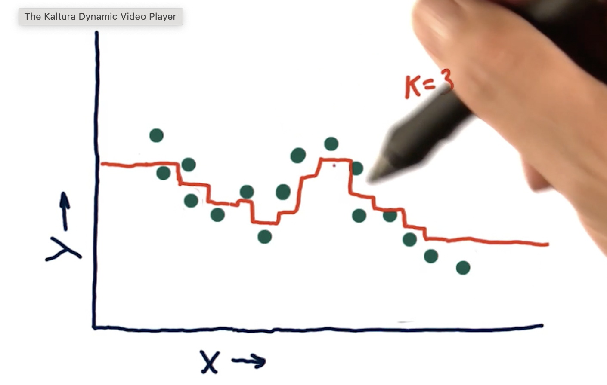
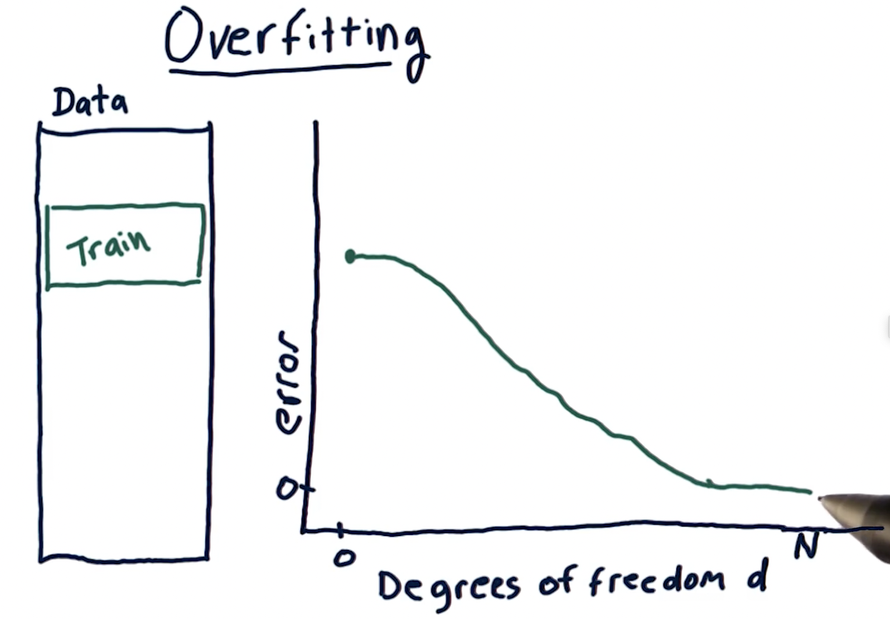
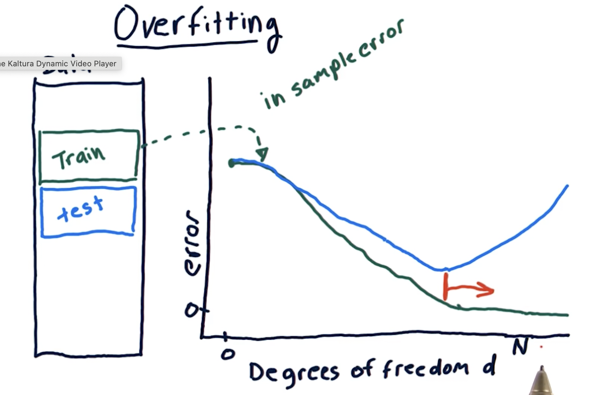

1. An issue with KNN is  

    - When you select a point at the tails, it has no reference points tightly close by.
    - Due to this it flat lines at the tail ends. Which gives you the same prediction for values that lie there.

2. As the K value increases, we are more likely to **not** overfit the data.
    - Overfit is when we try very hard to fit the line through the data exactly!
        - Overfitting happens when k = 1

3. With parametric regression, such as linear or polynomial regression:
    - As the degree of the polynomial increase, we tend to overfit the data.
    - Whcih means its likely that we will fit the data perfectly matching it at every point.

4. At the tail ends, parametric models tend to extrapolate which the KNN models **donot**

### RMS Error - Root Mean Squared Error 

- We use the following to calcualte error when building model
$$
\sqrt{\frac{\sum{(Y_{\text{actual}} - Y_{\text{predict}})^2}}{N}}
$$

- To calcucalte ***out of sample RMS*** we use the same formula as above but
    - Instead of using train data, we use test data to measure the error
    - The model equation itself comes from the train data. Then we use that model line to predict the values in the test data set.
    - We then calcucalte the RMS for the test output.
- Remeber that we always expct ***out of sample RMS*** to get greate than or equal to ***in sample RMS***
- In most cases, as RMS error increases, correlation goes decreases. But, in some rare cases, the correlation may increase. Thus, we really can't be sure

### Over fitting

1. First, we calcualte the in sample RMS by increasing the order of polynomials.
    - x, x 2, x 3, ...
2. As order of the degree of polynomials increase, the in sample RMS decreases.
    - i.e when we have as many parameters in our model as we have items in our dataset, the in sample RMS is at its **minimum**  
    
3. Next, calculate ***out of sample RMS*** for each degree of polynomial as above and graph it.
    - Remeber that we always expct ***out of sample RMS*** to get greate than or equal to ***in sample RMS***
4. As we plot in sample RMS vs out-of-sample RMS, the error decreases initially, but at after reach some degree of polynomial out-of-sample RMS might increase very strongly against in-sample-RMS. 
    
5. After reaching some degree of polynomial, the in-sample-RMS decreases while the out-of-sample RMS increases.
    - This phenomenon is called ***OVER FITTING*** 
    - This is the region at which Over fitting occurs.