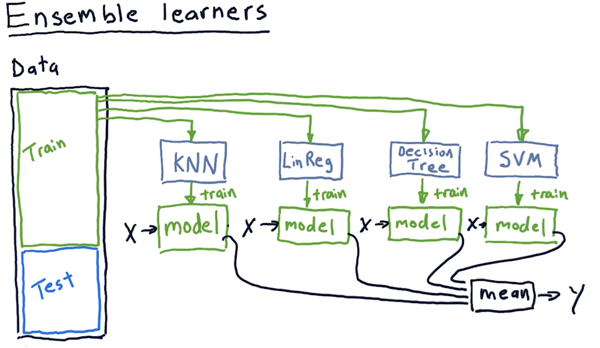
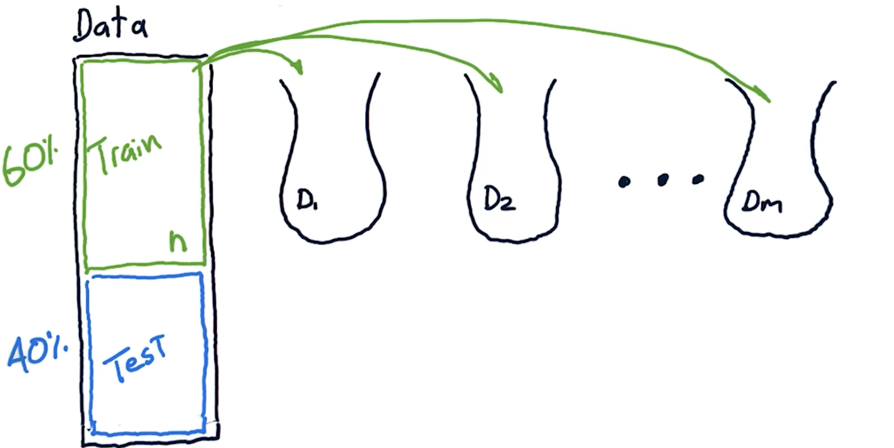
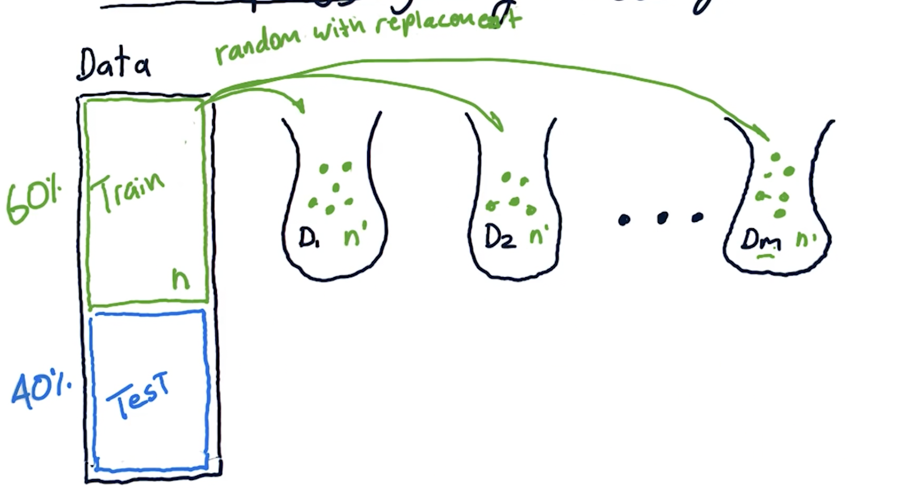
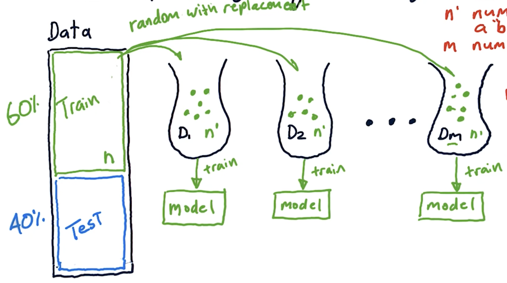
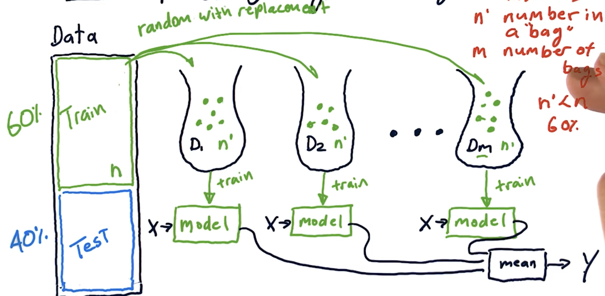

1. When you combine different learners to and take the mean of their output, it is called Ensemble learners.
2. Ex:  

3. We can also build an ensemble of learners by using a same learning algo (Ex: KNN) but train each learner on different set of the data.
    - This is called ***Bootstrap aggregating*** or ***Bagging***

### How Bootstrap Aggregating or Bagging work

1. Create number of subsets of data ----> Called bags.  
    
    - Here, 60% is trainnig data set. We create subsets of data (bags) from this training set.
2. Bags are created using
    - Random Sampling
    - Replacement = True
        - Each time we draw a value randomly, we consider the whole dataset.
        - This means, one value might repeat several times in one bag.
3. Each bag contains n' values. The whole training dataset contians n values.  
    
    - n' is always less than n.
        - n' <  n
    - n' is typically 60% of n.
4. Train m models on the m data bags.  
    
    - This creats an ensemble of different models.
5. We query each model with an x value from a test dataset which generates a predicted output Y.
    - Calcualte the mean of that Y value which becomes our new predicted value.
    
6. Wrap all of this in a single API as we did with KNN and Linear Regression.