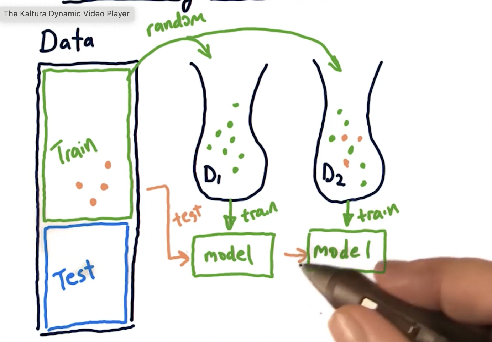
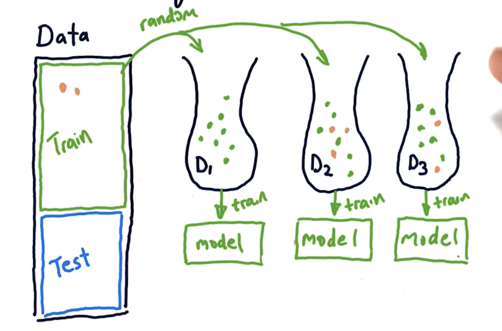

## Boosting

1. Its a variation of bagging.
2. Most popular algorith of boosting is: ***Ada Boost*** (adaptive boost).
3. Ada boost steps:
    <ol type = "I">
    <li> First create a bag similar to bagging. </li>
    <li> Train a model using that bag. </li>
    <li> Use all <b>training data </b> to test the model.</li>
    <li> There maybe some points in the training data which the model isn't predecting well. </li>
        <ul>
            <li> meaning, there is a large error present for some prediciton.</li>
        </ul>
    </ol>
4. Coming to the next bag:
    - Again, we choose randomly from our training set, but each instance is weighted according to the error in set:3
        - Which results in the x-values that resulted in higher error in the previous bag have a higher chance to go into this new bag.  
    
5. The in-sample data is again used to test the ensemble of both the models.
    - Then the error is measured again on the second bag.
    - We build the next bag using that error again  
    
6. This is continued for m bags - how many ever that is.

### Summary Bagging vs Boosting

1. In Bagging we randomly choose some x' values from x training values with ***replacement = true*** for each bag.
2. In Boosting, we do also calcualte the items in each bag that are resulting in the highest error. We then, use weighted instances to collect more samples.