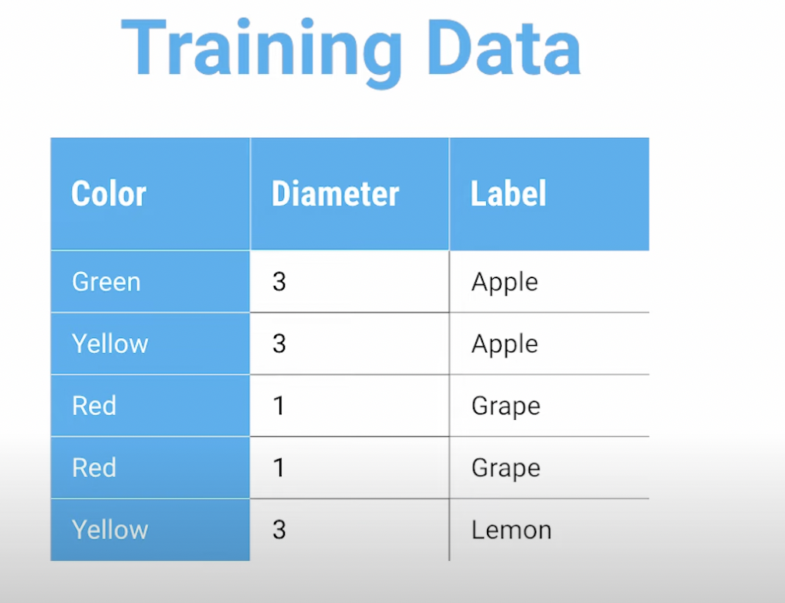

<style>
  img {
    width: 300px;
    height: 200px;
  }
</style>

#### What are required for decision trees?
Consider the data: <br>


1. Factors: X1, X2,....
    - In the example, factors are color and diameter.
2. Label : Y - which is our output we want to predict.
3. Nodes: root and lead nodes.
    - Factor used
    - Split value
    - Left link
    - Right link<br>
    
    - Factor -----> Diameter
    - Split value -------> >=3
    - left link -----> [Red 1 Grape, Red 1 Grape]
    - right link -----> [Green 3 Apple, Yellow 3 Apple, Yellow 3 Lemon]
4. We need not use all the factors in a decision tree.
    - It's perfectly fine to use only 3 factors out of 10 in a decision tree for example.

### The data structure for the decision tree
1. Use an ndarray with 2 dimensions
    - [factor, split value, left, right]
2. Each row in the ndarray corresponds to one decision node or a leaf.
    - The 0th row is always the root node.
    - The rest of the rows are split into 2 groups
        - One set of the rows represent the left tree.
        - The rest represent the right tree. 
3. Leaf nodes are always represented with ***factor = -1 ***
    - When you reach a row where the factor = -1, then you reached a leaf node.
4. Use relative numbers to reference to the rows you wanna get to.
*** Class room example ***
<br>

1. The decision tree:<br>


2. ndarray ==> [factor, split value, left, right]
    - root node
        - [factor = X_11, split_value = 10.0, left = 1, right = 8]

3. Example from ChatGpt
```py
import numpy as np

# Example decision tree structure
tree = np.array([
    [0, 5, 1, 2],    # Root node: split on feature 0 at value 5, left child at index 1, right at index 2
    [1, 3, -1, -1],  # Leaf node: feature 1, value 3
    [2, 7, -1, -1]   # Leaf node: feature 2, value 7
])
```