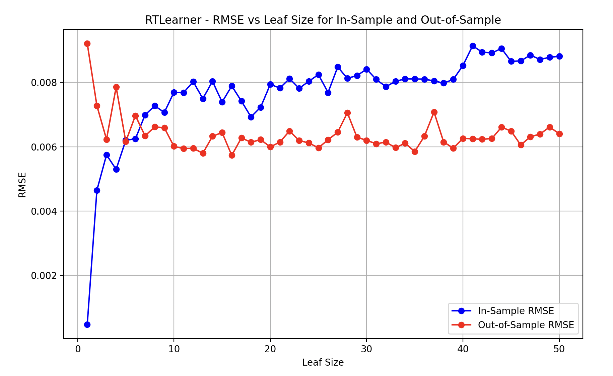

# Interpreting Overfitting from RMSE vs Leaf Size Graph

#### Istanbul.csv

The graph shows the Root Mean Squared Error (RMSE) for both in-sample (training data) and out-of-sample (test data) predictions as we vary the `leaf_size` of the `RTLearner`. This helps to identify overfitting and underfitting in the model.

## Key Points:
- **In-Sample RMSE (Blue Line):** Error on the training data.
- **Out-of-Sample RMSE (Red Line):** Error on the testing data.

### 1. Small Leaf Sizes (1-10)
- **In-sample RMSE:** Very low, indicating the model fits the training data extremely well, even capturing noise.
- **Out-of-sample RMSE:** High in comparison to in-sample, signaling **overfitting**—the model is too specific to the training data and generalizes poorly to unseen data.

### 2. Mid-Sized Leaf Sizes (10-25)
- **In-sample and Out-of-sample RMSE:** The gap between these two begins to converge, indicating a better balance between fitting the training data and generalizing to the test set.
- **Model behavior:** This region likely represents a sweet spot where the model is neither overfitting nor underfitting.

### 3. Large Leaf Sizes (25+)
- **In-sample RMSE:** Gradually increases, reflecting that the model is becoming too simple and no longer capturing enough detail from the training data (underfitting).
- **Out-of-sample RMSE:** Remains relatively stable but stops improving. This suggests the model is overly biased and cannot capture more complex patterns.

## Indicators of Overfitting:
- **Large gap between In-sample and Out-of-sample RMSE** at smaller leaf sizes, indicating the model fits training data too well but struggles with generalization.
- **Sharp decrease in in-sample RMSE** with a comparatively high out-of-sample RMSE for very small leaf sizes (e.g., leaf size = 1) is a clear sign of overfitting.

## Conclusion:
- **Optimal Region:** A leaf size between **10 and 25** appears to strike a good balance between underfitting and overfitting.
- Aim to minimize the gap between in-sample and out-of-sample RMSE for the best generalization performance.

