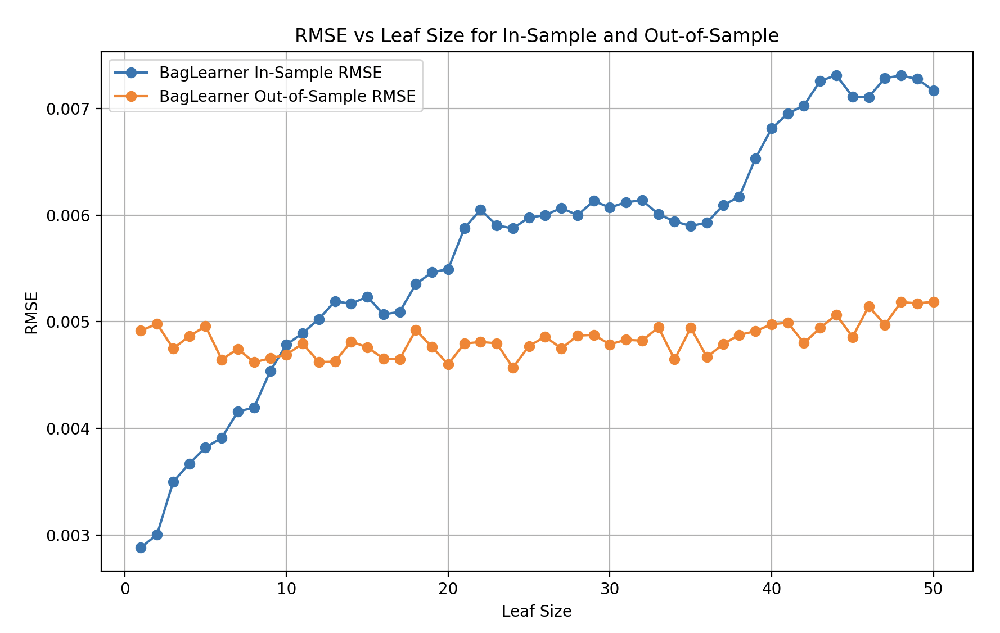

# Analysis of Bagging and Overfitting with Respect to Leaf Size

This document summarizes the interpretation of the RMSE plot for BagLearner and how bagging affects overfitting with respect to different leaf sizes.

#### Bagging uses DTLearner with varying leaf sizes and 10 bags.

## Plot Overview
- **X-axis (Leaf Size)**: Represents the leaf size for the decision trees, ranging from 1 to 50.
- **Y-axis (RMSE)**: The Root Mean Squared Error (RMSE), which represents the prediction error. Lower RMSE values are better.
  
- **Blue Line**: In-sample RMSE (training data).
- **Orange Line**: Out-of-sample RMSE (testing data).

---

## Can Bagging Reduce Overfitting with Respect to Leaf Size?
Yes, bagging **can reduce overfitting**.

- The **blue line (in-sample RMSE)** increases with leaf size. This indicates simpler models as leaf size increases, leading to underfitting.
- The **orange line (out-of-sample RMSE)** stays stable, showing that **bagging** helps in generalizing the model to unseen data, thus reducing overfitting to some degree.

---

## Can Bagging Eliminate Overfitting with Respect to Leaf Size?
No, bagging **cannot completely eliminate overfitting**, but it can mitigate it.

- **Overfitting** occurs when there's a large gap between the in-sample and out-of-sample RMSE.
- In this case, overfitting is visible for **smaller leaf sizes** (below 10-15) where the in-sample RMSE is low but the out-of-sample RMSE is higher.

---

## Where is Overfitting Occurring?
Overfitting is evident when the **in-sample RMSE** is much lower than the **out-of-sample RMSE**.

- In this plot, overfitting is most noticeable for **leaf sizes between 1 and 15**. The in-sample RMSE is very low in this range, but the out-of-sample RMSE is relatively higher, signaling overfitting.
  
---

## How to Explain Overfitting?
Overfitting happens when a model becomes too complex, learning specific patterns and noise from the training data that do not generalize to unseen data. In this case:
- **Complex models (small leaf sizes)** overfit, leading to very low in-sample RMSE but higher out-of-sample RMSE.
- **Bagging reduces the variance** by averaging the predictions from multiple models, leading to better generalization.

---

## Summary:
- **Bagging reduces overfitting**, but it cannot eliminate it completely.
- Overfitting is more pronounced for **small leaf sizes** (high complexity), where the gap between in-sample and out-of-sample RMSE is large.
- **Bagging helps smooth out** this effect by averaging predictions, leading to better performance on unseen data.
