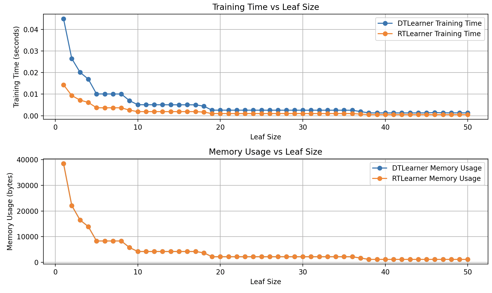

## Insights: Training Time and Leaf Size in DTLearner vs RTLearner

### 1. **Observation: DTLearner Takes More Time to Train than RTLearner**
When training with smaller leaf sizes, the **Decision Tree Learner (DTLearner)** takes more time compared to the **Random Tree Learner (RTLearner)**. This difference in time is attributed to:

- **Optimal Split Search**: DTLearner needs to search for the best feature and threshold for splitting at each node. This process involves comparing multiple features and calculating the information gain or other criteria for each, which can be computationally expensive.
  
- **Random Splitting in RTLearner**: In contrast, RTLearner randomly selects features to split, skipping the optimization process that DTLearner undertakes. This makes it faster during the construction of smaller trees.

### 2. **Memory Usage: Similar for Both Learners**
Despite the time difference, the **memory usage is similar** for both learners in most cases. This is because:

- **Tree Structure**: Both learners ultimately store the tree in memory, which consists of nodes, leaf nodes, and references to data points. Since both DTLearner and RTLearner are building trees, they use memory similarly to store the tree structure, regardless of the time taken for training.

- **Leaf Size Impact**: As the leaf size increases, the depth of the tree reduces, resulting in fewer nodes for both learners, leading to a similar memory footprint.

---

### 3. **Convergence of Training Time as Leaf Size Increases**
As the leaf size increases, the training times for both **DTLearner** and **RTLearner** converge. This behavior is due to:

- **Fewer Splits to Compute**: With larger leaf sizes, both learners have fewer nodes to split. This means the tree stops growing earlier, reducing the overall time spent calculating splits.
  
- **Simplified Trees**: Larger leaf sizes result in shallower trees for both learners, leading to a reduction in computational overhead. Fewer nodes are created, making the tree-building process faster for both learners.

- **Random vs. Deterministic Splitting Becomes Negligible**: At smaller leaf sizes, DTLearner spends more time finding the optimal split, while RTLearner selects splits randomly. However, with larger leaf sizes, the impact of optimal vs. random splitting is reduced since fewer splits are needed, leading to similar processing times.

### 4. **Conclusion: Leaf Size's Role in Training Time**
- With **smaller leaf sizes**, DTLearner is slower due to its split optimization process, while RTLearner is faster due to random selection.
- As **leaf size increases**, both learners experience reduced tree complexity and fewer splits, which leads to the convergence in training time for both learners.
