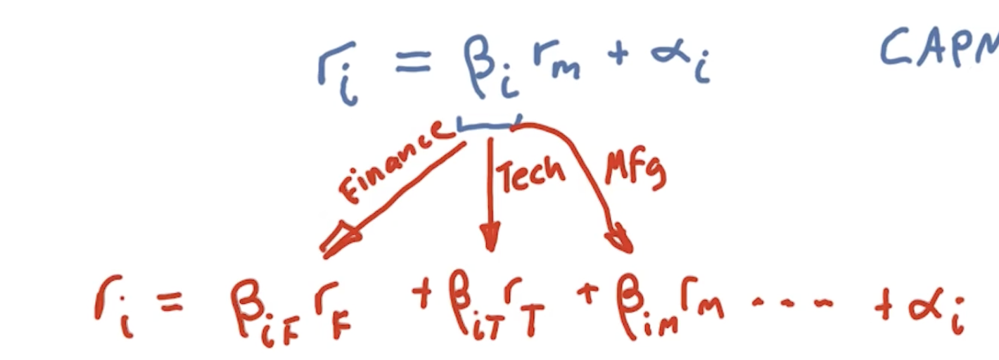

## In Summary:
CAPM tells us that the expected return on our portfolio:
- rp = $\beta$p rm + $\alpha$p
- Beta of the portfolio * return on the market + $\alpha$ of the portfolio.
- Alpha is both random and has an expected value, E(x) = 0.
    - This eliminated alpha from our toolbox.
- The only way to beat the market is by cleverly choosing $\beta$
    - When market is going up, choose a **larger Beta** as this increases our return.
    - When the market is going down, choose a **very small Beta** so that we won't crash as much as the market. 
- BUT, Efficient Market Hypothesis (EMH) says that you can't predict the market.
    - So choosing a large beta while market up or small beta while market down is also not possible anyway!
- CAPM basically says that **You can't beat the Market**

## Arbitrage Pricing Theory - APT

CAPM ==> ri = $\beta$i rm + $\alpha$i

- APT suggests that we should break up the single beta into multiple betas that affect the stock.
    
    - Here the stock is impacted by Finance, Technology, Mfg, etc...
- This gives a more accurate forecast of how the stock returns are gonna look like. 
- APT is not used in this class.
