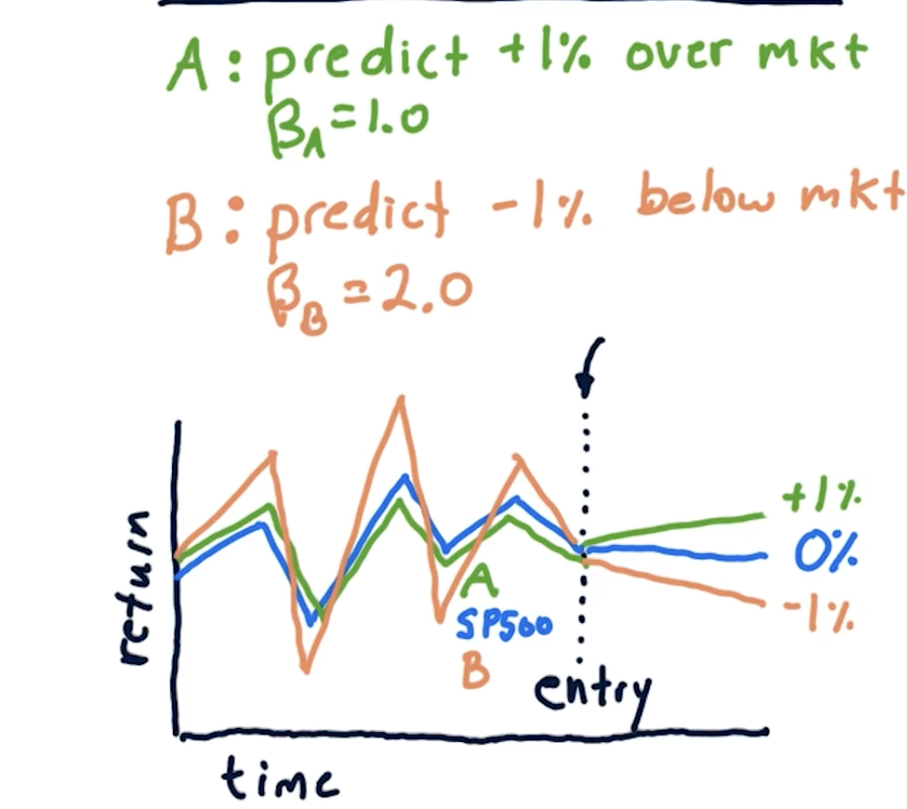
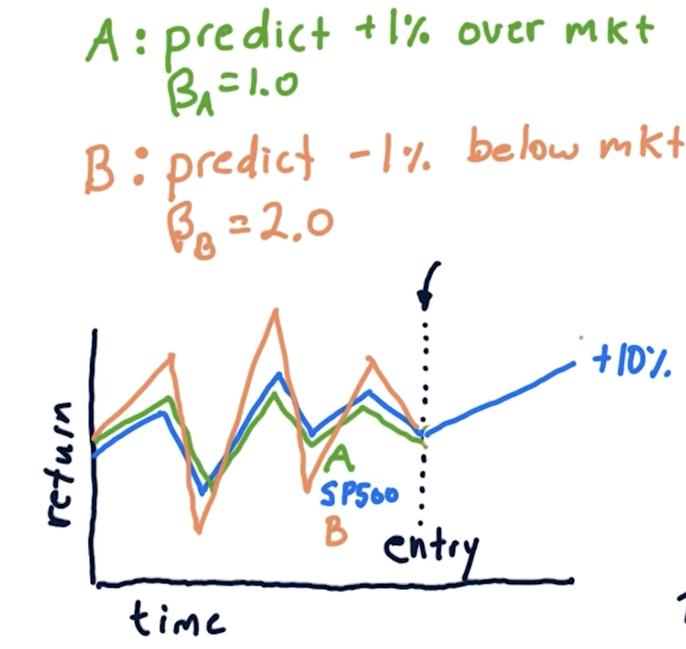

## How Hedge Funds use CAPM

Ex: Following presents the idea of going long and short  
- Prediction from a Hedge fund is that **Stock A** to go +1% over market with $\beta$A = 1.0 I.e whichever way the market goes (up or down), Stock A will go UP 1%
    - As this is predicted to go up, go LONG here.
- They predict ***Stock B*** would go -1% below market with $\beta$B = 2.0. I.e whichever way the market goes (up or down), Stock B will go DOWN 1%
    - As it is predicted to go down, go SHORT here.
- The question here is how to best allocate funds between long and short? Below is an example where the market (SP500) is flat (0% returns) for the next few days. If we allocate $50 to A and (minus)$50 to B (short), what are the returns?
    

- Ans: 
- CAPM for Stock A==> rA = $\beta$A rm + $\alpha$A
    - rm is market return. Therefore = 0
    - $\alpha$A = 1% from the question. We invested $50
    - rA = $\alpha$A ====> $.50
- CAPM for Stock B==> rB = $\beta$B rm + $\alpha$B
    - rm is market return. Therefore = 0
    - $\alpha$B = -1% from the question. We invested -$50 (short)
    - rB = $\alpha$B => -0.01 * - 50 ==> $0.50
- Total: $0.5 + $0.5 = $1.00
    - Which is 1% of our total investment.

**Example 2** Same as above but instead of market staying flat, it went up by 10%.  

- What is the expected return on stock A rA?
- What is the expected return on Stock B rB?
- What is the expected money in dollar on stock A rA?
- What is the expected money in dollar on stock B rB?
**ANS**
- CAPM for Stock A % return==> rA = $\beta$A rm + $\alpha$A
    - rm is market return. Therefore = 10%
    - $\alpha$A = 1% from the question. We invested $50
    - rA = $\beta$A rm + $\alpha$A
        - 1.0 * 0.1 + 0.01
        - 0.1 + 0.01 = 0.11 or 11%
- CAPM for Stock B % return==> rB = $\beta$B rm + $\alpha$B
    - rm is market return. Therefore = 10%
    - $\alpha$B = -1% from the question. We invested -$50
        - The market went up not down in this scenario.
    - rB = $\beta$B rm + $\alpha$B
        - 2 * 0.1 - 0.01
        - 0.19 or 19% However, remeber that we made a negative bet in this case (shorting of -$50)
- CAPM for Stock A dollar return==> rA = $\beta$A rm + $\alpha$A
    - As return was 11% and we invested $50
        - 0.11 * 50 = $5.5
- CAPM for Stock B dollar return==> rB = $\beta$B rm + $\alpha$B    
    - The return for stock B was 19% but we shorted -$50
        - 0.19 * -50 = -$9.5
        - We shorted the stock expecting it to go down. But it went up instead. So we lost $9.5
- Total $ Made = 5.5 - 9.5
    - (-)$4.00
- Total % returns = 11% * 0.5 - 19% * 0.5
    - 0.5 here is the allocations we gave to stock A and B. We allocated half of our funds to each.
    - 0.11 * 0.5 - 0.19 * 0.5
    - 0.055 - 0.095
    - (-)0.04 0r -4% return