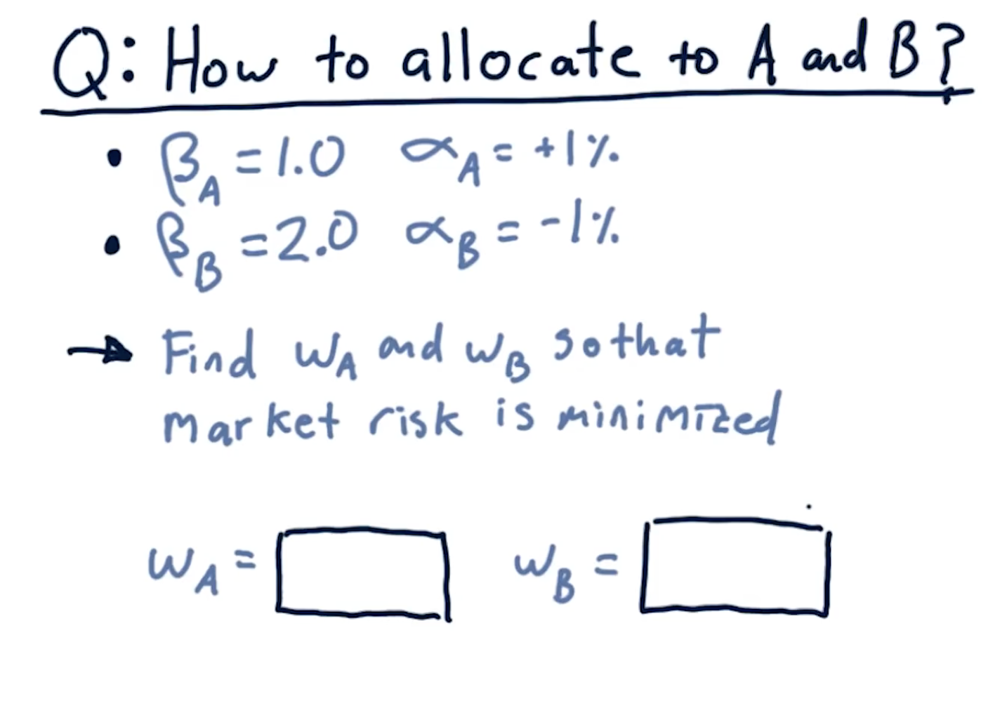
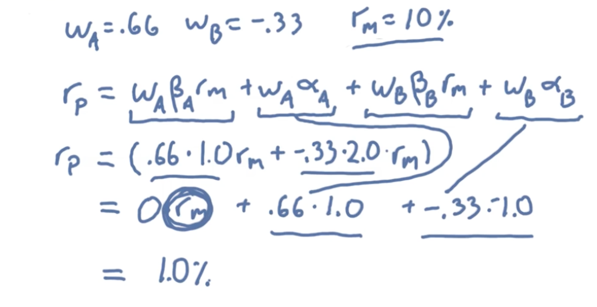

## How to allocate weights.

Suppose we have 2 stocks A and B.  

- As A has +ve alpha we go for **Long**
- As B has -ve alpha we **Short** the stock. 
**Ans** 
We want to make WA $\beta$A + WB $\beta$B = 0 
=> WA + 2WB = 0 
=> WA = -2WB 
Also, remember that `Absolute`(WA) + `Absolute`(WB) = 1  
- Because these are weights that we are assigning to different stocks and they must add up to one.
- The reason for taking absolute wieght is beacuse when we short a stock, we assign it a `-ve weight`.
- In this example, WB has a negative weight
 
=> `Absolute`(WA) + `Absolute`(WB) = 1  
=> WA = -2WB 
Therefore, `Absolute` (-2WB) + `Absolute`(WB) = 1  
=> 3`abs` (WB) = 1 
=> WB = 1/3 
As we are **Shorting** B, it will get a -ve sign 
=> WB = -1/3 
=> WA = -2(-1/3) 
=> WA = 2/3 

**Final Weight Allocations are WA = 2/3 and WB = -1/3**

## Plugging these values into our original qustion to compute rp - Portfolio return

- We get a 1% portfolio return regardless of which way the market goes now, as removed the market return risk.