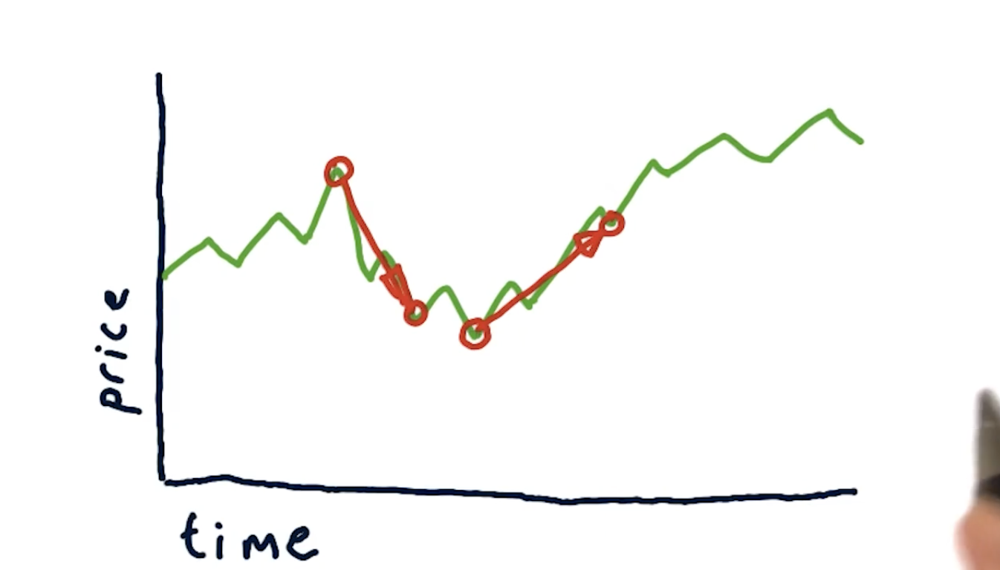
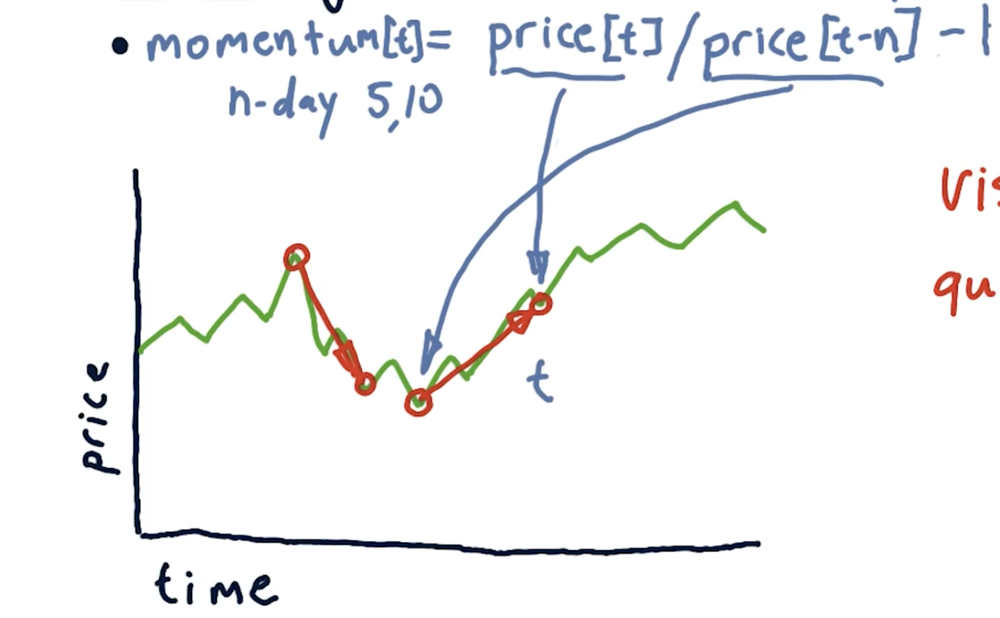
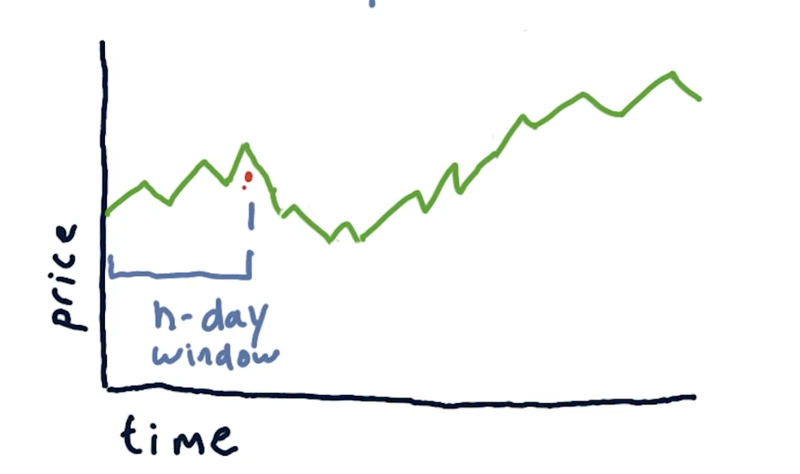
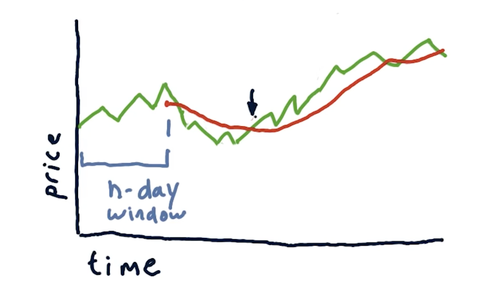
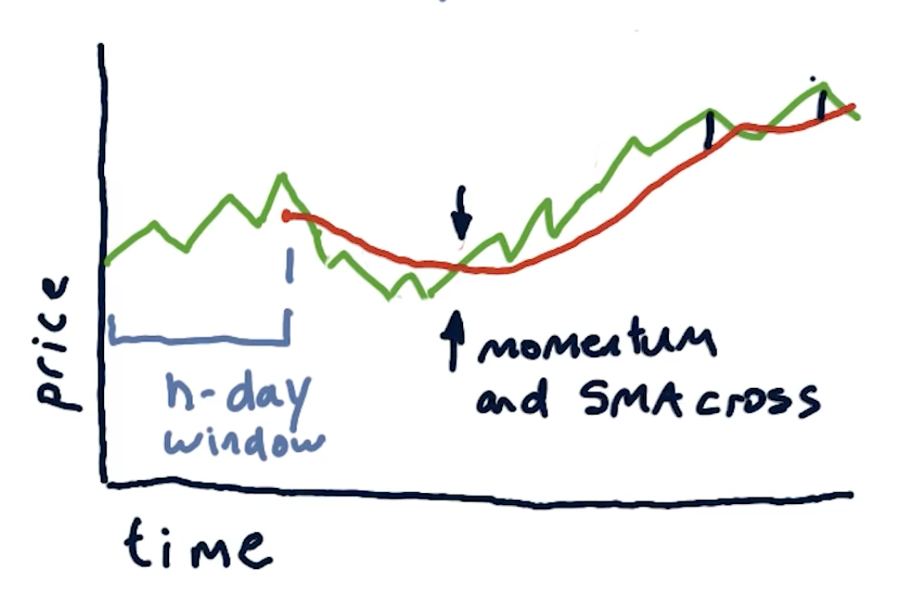
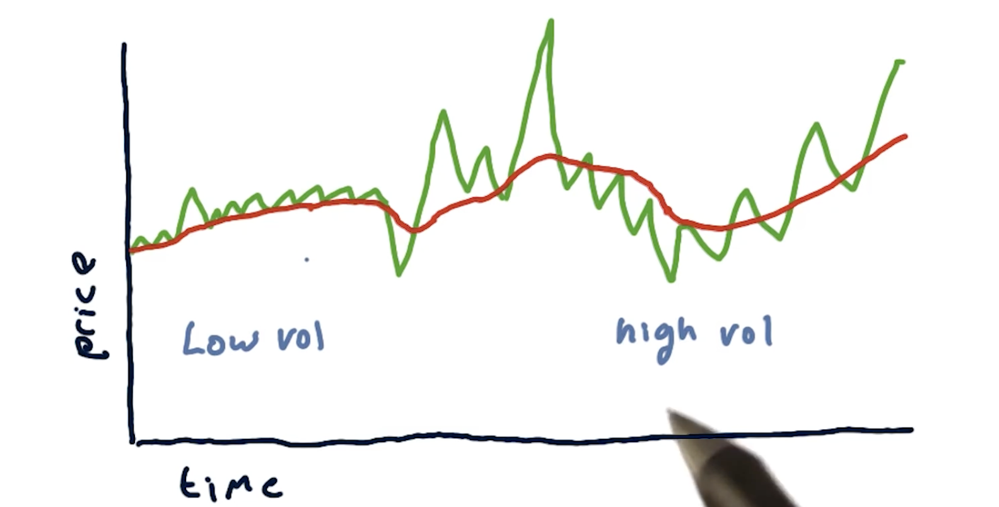
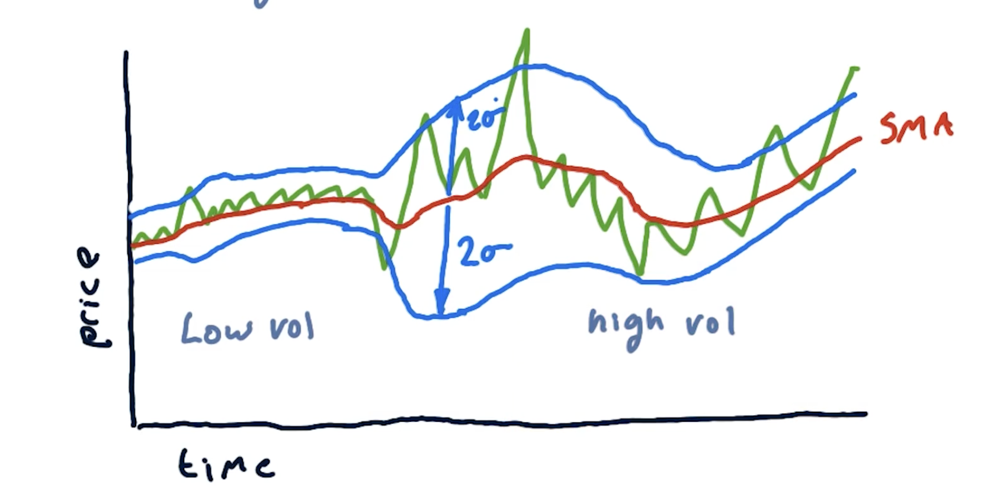
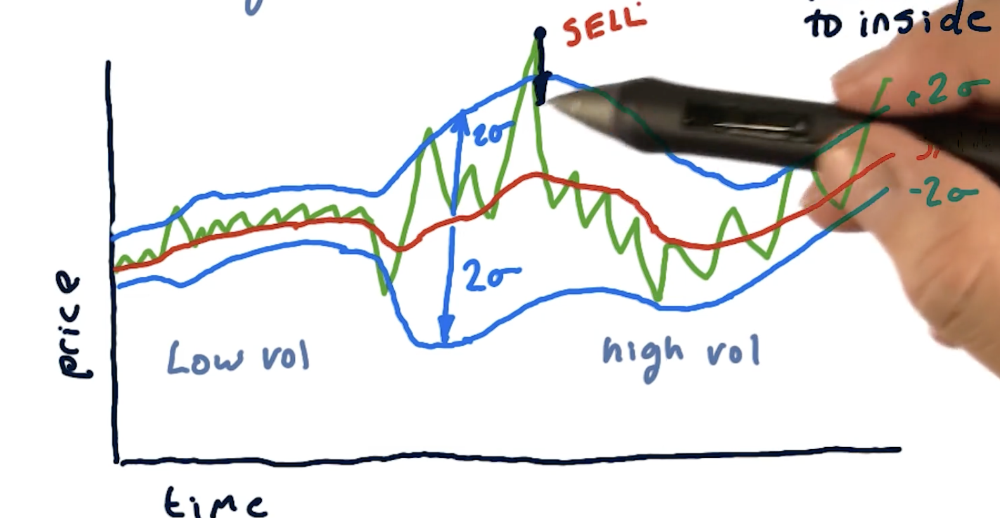
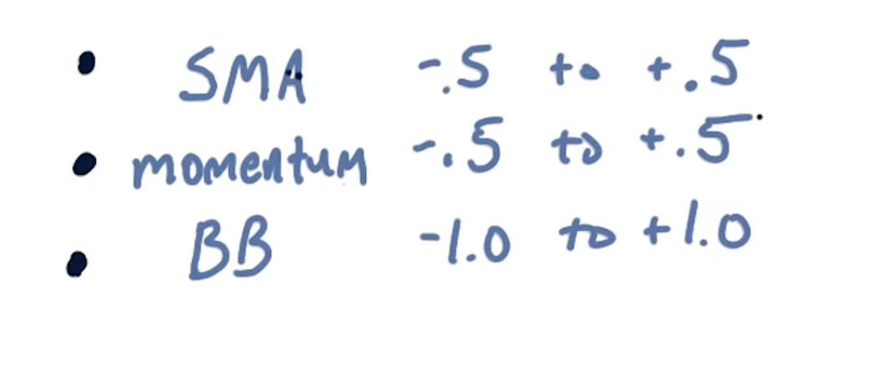

## Technical Analysis
1. Technical Analysis looks for patterns or trends in the stock price.
2. How does it work?
    - Looks **Only** at historical data and volume.
    - Compute statistics called **Indicators** on the historical data (normally in time series format).
    - indicators are heuristics that indicate a buy or sell option.
#### What are good techinical indicators.
1. Momentum
2. Simple Moving Avg (SMA)
3. Bollinger Bands

### Momentum
1. **Momentum**: Over some no. of days how much the price has changed.  
    
    - Down arrow is downward momentum 
    - Up arrow is upward momentum.
    - Steepness of the arrow is the strength of Momentum.
2. For machine learning, Momentum needs to be converted into number so that it is expressed quantitatively.
3. We talk about "how many days of Momentum"
 - `Momentum`[t] = Price[t]/ Price[t-n] - 1
 - n = 5, 10, .. days
 - t = particular day 
 

4. Momentum is usually seen in the range of -0.5 to +0.5
    - Meaning a 50% drop or 50% gain.

### Simple Moving Average (SMA)
1. We take SMA for n-days (how many days we are looking back). 
    - 
    - SMA of that day (red point) is the avg price of n-day window.
2. SMA indicator is used in atleast 2 different ways 
    - 
    - When the price crosses the SMA line. Combine this with Momentum on strong that direction is and you have a good combination of technical indicators.
    - Another way is to use SMA as the representation of the true value of the company. When the price of the stock crosses this SMA, you can expect it to return to the SMA.
    - 
        - The picture above might represent a sell opportunity at the black dots.
3. To quantify this, you can compare the current price to the SMA at any given time and construct a ratio.
    - `SMA`[t] = Price[t] / Price[t-n:t].mean() - 1
    - Price[t-n:t].mean() = Mean for the last n days
4. Similar to Momentum the range for SMA is between -0.5 to +0.5
    - Whcih is -50% to +50%

### Bollinger Bands
Helps as indicator for "How much movement away from SMA" should you use for buy or sell.

- On the left there is low volatility region. Right = high volatility region.
- For stocks that are currently experiencing low volatility, use small number as trigger for buy or sell.
    - If it moved +0.03 over SMA, use it as a Sell signal.
- For volatility use a larger number
    - Use +0.1 or 10% as a Sell trigger.
- To accomplish this, use 2 STD.
    - 
- To use this techincal indicator effectively, observe when the prices from the outside of the bands crosses the inside of the band
    - 
    - black arrow show the price crossing from outside to inside. This represents a Sell signal.
    - Basically, remember to wait untill it crosses the inside of the band and then use it as a Buy or Sell signal.
- To compute `Bollinger Bands`:
    - BB[t] = $$ \frac{\text{Price}[t] - \text{SMA}[t]}{2 \cdot \text{STD}[t]} $$
    - t = some day
- The range you see typically is -1 to +1

### Normalization
The typical ranges for our techincal indicators so far:
- 
- If you don't Normalize these different values, you tend to have problems in machine learning.
- After normalizing, the values are between `-1` to `+1`
- Normalized = $$ \frac{\text{values} - \text{mean}}{\text{STD}} $$
 

