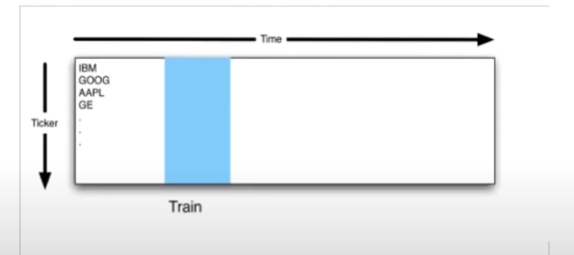

1. Technical features are calculated based on **Price and Volume**
2. If the model is based on market close (which our model is), remember that you **cannot** trade at market close. You must wait until the next day when the market opens.

### Backtest to validate the model
1. Look back at a **constant** amount of time to train your model.
    - Instead of looking all the way back at all the data.
2. Here the blue portion is the data we train our model on  
    - 
    - Then we forecast our predictions for the future, say 5 days from today.
        - Based on that forecast, we either buy or sell our stock today.
3. This method is called **Roll forward cross validation**
    - The training data is always the older data. <code>past</code>
    - The testing data is always the newer data.(`future`)
    - We roll forward with this approach.

#### How back tests can go wrong
1. **In-sample Backtest**: Backtesting over the same data you used for training.
    - To avoid this, Train over 2007 year and test over 2008-forward.
    - For the project, you are allowed to test in-sample.
2. **Survivor Bias**: 
    - When you back test data, remember that some companies would die out in the future.
    - After 2008-09, 55 companies in S&P 500 died. That's 11% companies not present anymore.
    - Survivor bias is when you only collect data from subjects that make it back alive.
        - For example, you gather evidence from soliders who returned from a war about where they were shot at by the enemies the most. This data is Biased because other soliders who didn't make it back alive might have been shot at different areas which proved more fatal. If you decide to make an armor based on this information that would cover certain areas to protect the soliders based on the data collected from soliders who made it back alive, it might not work well. Becuase it doesn't represent a whole picture.
    - **How to Prevent Survivor Bias?**:
        - You need a list of stocks that existed in 2008 and 2012.
        - For a set of major indexes, have info about on everyday in history, which stocks made up those indexes.
3. **Ignoring Market Impact**:
    - If you made predictions on the future prices based on the back tested data, it would work.
    - It would work well if you are making **only** prediction but never `acting` on those predictions.
        - Meaning you would make a prediction on whether a stock would go up or down in the future but never buy or sell.
    - This is important because when you act on it, your new market orders would impact the market leadning to changes in prediction.

## Case study in Vectorization of Technical Strategy Python Code
This is for the assignment.
- You have to create a custom technical indicator i.e any information time series that you can create from the **Price** and **Volume** information.
- Use that technical indicator to create a custom trading strategy.
    - Use this to backtest in time and evaluate its performance.
- You will create a **orders file** out of this project. 
    - Use market simulation project to evlaute how well your strategy works.
- Finally, given any date range and symbols to your project, generate an orders file about what your strategy would do for those time periods and those symbols.

**Georgia Tech Example**
1. Used a basket indicator. It uses several test indicators instead of 1. 
    - This basket indicator looks for divergance between the stocks and the stock market. 
    - Divergance strategy is when you find 2 things that normally move together. 
    - Most times the stocks move up when the market goes up. Down when the market goes down.
        - Sometimes, some stocks break this behavior and goes up when the market goes down and down when the market goes up.
2. Technical indicators used to create the basket indicator are:
    - Price to SMA ratio => Price/SMA
        - Today's price / SMA over some time period. 
        - If the result is 1, it means we are right at the SMA
        - Less than 1, we are below the SMA.
        - Greater than 1, we are above the SMA.
    - Bollinger Bands %
        - Tracks SMA as the central line of the bands. 
        - SMA + 2*STD as the upper band. 
        - SMA - 2*STD as the lower band. 
        - This indicator is used to trade when you cross into these bands from outside of the bands.
        - Here the percentage is used to determine how far you are from the bottom band to the top band. 
            - Bottom band is 0%. Top band is 100%
    - Relative Strength Index (RSI):
        - This is an oscillating indicator. 
        - It is a ratio of on the days the stock goes up how much it goes up divided by on the days the stock goes down, how much it goes down.
3. The strategy:
    <ol type = "i">
    <!-- <li> </li> -->
    <li>Go Long when the stock is over sold and the index is not oversold</li>
    <li>Go Short when the stock is over bought and the index is not.</li>
    <li>Close position when the stock crosses through its SMA </li>
    </ol>
    - A symbol is overbought when:
        - Price/SMA ratio > 1.05
        - Bollinger Bands ratio > 1%
        - RSI > 70
    - A symbol is oversold when:
        - Price/SMA ratio < 0.95
        - Bollinger Bands ratio < 0
        - RSI < 30
