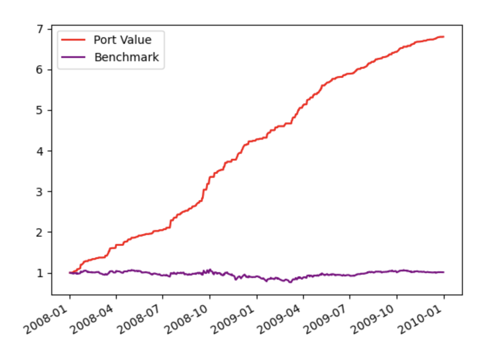

### Summary of Theoretically Optimal Strategy vs. Benchmark Performance

#### Plot Description:
- **Red Line**: Represents the Theoretically Optimal Strategy (TOS) portfolio value, normalized to 1.0 at the start.
- **Purple Line**: Represents the benchmark (1000 shares of JPM held throughout), also normalized to 1.0 at the start.

#### Key Statistics:
- **Mean of Portfolio Daily Returns**: `0.003843` (0.3843% per day on average)
- **Cumulative Return of Portfolio**: `5.7984` (579.84% total return over the period)
- **Standard Deviation of Portfolio Daily Returns**: `0.008262` (lower volatility)
  
- **Mean of Benchmark Daily Returns**: `0.000168` (0.0168% per day on average)
- **Cumulative Return of Benchmark**: `0.0123` (1.23% total return)
- **Standard Deviation of Benchmark Daily Returns**: `0.017004` (higher volatility)

#### Interpretation:
- **Theoretically Optimal Strategy (TOS) Performance**: 
  - The TOS outperformed the benchmark significantly, achieving a **cumulative return of 579.84%** compared to the benchmark's **1.23%**.
  - The TOS was able to grow the portfolio value dramatically over time, as it was designed to take advantage of perfect foresight in trades (knowing future price movements).
  
- **Lower Risk, Higher Return**: 
  - Despite achieving much higher returns, the TOS portfolio had **lower volatility** (standard deviation of `0.008262`) compared to the benchmark (`0.017004`). This means that the portfolio was less risky in terms of daily fluctuations while still performing far better.

- **Benchmark Performance**: 
  - The benchmark, which represents holding 1000 shares of JPM throughout the period, **barely increased** in value, with only a **1.23% cumulative return**. 
  - This reflects the poor overall performance of the market during the **2008 financial crisis**, where passive strategies struggled.

#### Conclusion:
- The TOS highlights the potential for maximizing returns through ideal trading (using foresight), while the benchmark shows the conservative performance of holding a fixed number of shares through a volatile period.
 

