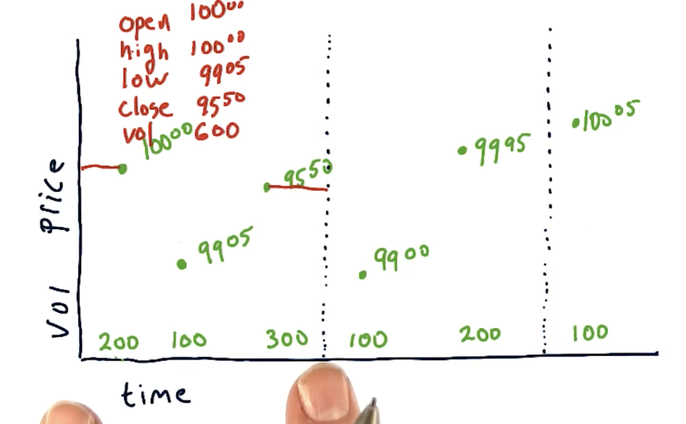
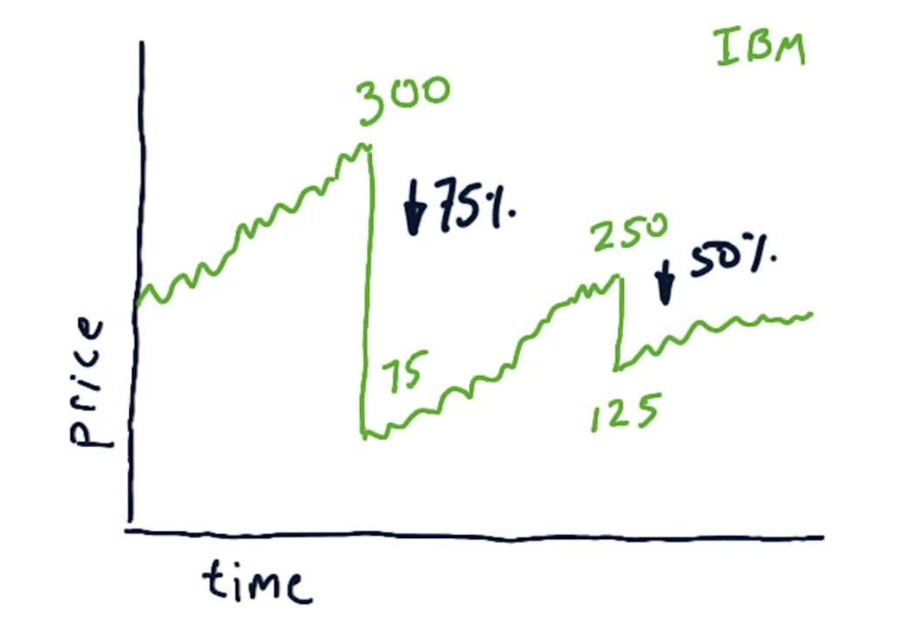

## How data is aggregated

1. Normally data aggregation is computed per minute or per hour or per day.
2. The values used for aggregation are
    - ***Open***: What price did the stock open
    - ***Close***: What price did the stock close
    - ***High***: How high did it go during that time period
    - ***Low***: How low did it go during that time period.
    - ***Volume***: How much volume is traded during that time.
3. ***Ex:*** Below is per minute ticker  
    - 
    - The bottom values of [200, 100, 300] is the volume of stock that was bought or sold at what price.
        - 200 traded (buy or sell) at $100.00
        - 100 traded at $99.05
        - 300 traded at $95.50
    - The `Open` is at $100.00
    - `Close` is at $95.50
    - `High` is at $100.00
    - `Low` is $95.50 (the picture is wrong)
    - `Volume` traded = 200 + 100 + 300 = 600 stocks
4. In ML4T the time boundary is not per minute bur `per day`.

### Stock splits cause price anomolies
- 
- If a stock is split into 2 units, then the value of each new unit is 50% of the original price.
- This is what likely caused the price anomolies that you would notice in the charts.
    - `Anamoly` is when the price drops suddenly by a lot.
1. **Why do Stocks Split ?**
    - Price is too high making it hard to buy.
2. **What issues does it cause to our trading model ?**
    - The algo might look at the price drop where the split happened and would see it as a `shorting` opportunity.
        - This is bad becuase even though the price has fallen, the value is still retained becuase instead instead of owing 1 stock at $250, you now own 2 at $125 each.
    - When you are using the market `close` data, make sure you are taking into account the splits.
3. The solution is this splitting problem is....... `Adjusted Close`
    - It basically adjusts for each of the splits in history.

### Dividends
The data we will be working with in this class are **daily close values**. They contain both `actual` and `adjusted` close values. We should use adjusted close values in our calculations.

### Survivor Bias
1. Always remember to use Survivor Bias free data.
    - This is not free data and you should buy it to use it.